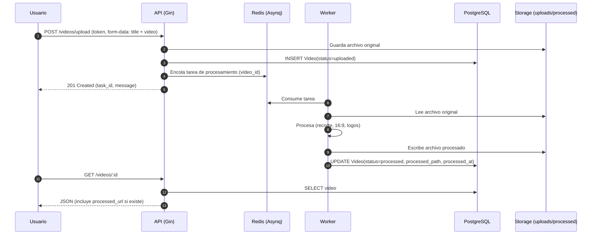

# 📘 ANB API – Documentación Integral

> Última actualización: 2025-09-08 00:03:50 (hora UTC)


## 1) Descripción general
API REST para la gestión de **jugadores**, **videos** y **votaciones**. Integra **procesamiento asíncrono** mediante worker y broker de tareas, base de datos relacional y almacenamiento de archivos.
Incluye: endpoints, modelo de datos, diagramas de arquitectura y flujo, guía de despliegue y guía de pruebas en Postman.

---

## 2) Modelo de datos (ERD)
A continuación, un **diagrama Entidad–Relación** (ERD) propuesto a partir del comportamiento del backend. Si tu esquema real difiere, ajusta atributos o relaciones puntuales.

```mermaid
erDiagram
    USERS ||--o{ VIDEOS : "sube"
    USERS ||--o{ VOTES  : "emite"
    VIDEOS ||--o{ VOTES : "recibe"

    USERS {{
        uuid id PK
        string first_name
        string last_name
        string email UNIQUE
        string password_hash
        string city
        string country
        timestamp created_at
        timestamp updated_at
    }}

    VIDEOS {{
        uuid id PK
        uuid user_id FK
        string title
        string status  "uploaded | processed"
        string original_path
        string processed_path
        timestamp uploaded_at
        timestamp processed_at
    }}

    VOTES {{
        uuid id PK
        uuid user_id FK
        uuid video_id FK
        timestamp created_at
        UNIQUE "user_id, video_id"
    }}

    PROCESSING_TASKS {{
        uuid id PK
        uuid video_id FK
        string state   "queued | processing | done | failed"
        string worker_node
        string error_message
        timestamp enqueued_at
        timestamp finished_at
    }}
```

### Especificación de entidades y relaciones
- **Users**: jugadores registrados; `email` único; la **contraseña se almacena hasheada**.
- **Videos**: pertenecen a un usuario; estados: `uploaded → processed`.
- **Votes**: un usuario puede **votar una sola vez** por cada video (índice único compuesto).
- **Processing_Tasks**: cola de tareas para procesamiento (enlazada a `video_id`).
- Relaciones clave:
  - `Users 1..N Videos`
  - `Users 1..N Votes`
  - `Videos 1..N Votes`

> Nota: si tu migración ya define tipos/longitudes específicas (p. ej. `status` como enum), reemplázalo aquí para que la doc quede 1:1 con el esquema.

---

## 3) Documentación de la API (Postman)
### Archivos
- `ANB_API_Postman_Collection.json` – colección con todos los endpoints.
- `ANB_API_Local.postman_environment.json` – entorno local (`{{base_url}} = http://localhost:9090`).

### Base URL
```
http://localhost:9090/api/v1
```

### Endpoints
#### Auth
- `POST /auth/signup` – Registro de jugadores (valida `email` único y contraseñas).
- `POST /auth/login` – Retorna `access_token` (JWT).

#### Videos (requiere JWT)
- `POST /videos/upload` – form-data (`title`, `video`).
- `GET /videos` – lista los videos del usuario.
- `GET /videos/:video_id` – detalle.
- `DELETE /videos/:video_id` – elimina si procede.
- `POST /videos/:video_id/mark-processed` – marca como procesado.

#### Público
- `GET /public/videos` – lista videos públicos.
- `GET /public/rankings` – ranking por votos.

#### Votes (requiere JWT)
- `POST /public/videos/:video_id/vote`
- `DELETE /public/videos/:video_id/vote`

### Pruebas sugeridas en Postman
1. **Login** y guardado automático del token (`{{token}}`) vía script de tests (incluido).
2. **Upload** con `form-data` (campo `video` como **File**).
3. **Flujo**: signup → login → upload → listar → consultar detalle → votar → ranking.

---

## 4) Diagrama de componentes
```mermaid
flowchart LR
    subgraph Client[Cliente / Postman / Frontend]
        A[Requests HTTP]
    end

    subgraph Backend[API Backend (Gin)]
        B1[Auth Controller]
        B2[Video Controller]
        B3[Vote Controller]
        B4[Tasks Enqueuer]
    end

    subgraph Broker[Redis (Asynq)]
        Q[Cola de tareas]
    end

    subgraph Worker[Worker de procesamiento]
        W1[Procesa video: recorte, 16:9, logos]
        W2[Actualiza estado y rutas del archivo]
    end

    subgraph Storage[FS / Bucket]
        S1[uploads/ originales]
        S2[processed/ finales]
    end

    subgraph DB[(PostgreSQL)]
        D1[(users)]
        D2[(videos)]
        D3[(votes)]
        D4[(processing_tasks)]
    end

    A -->|HTTP| Backend
    Backend -->|JWT/Auth| DB
    Backend -->|INSERT/UPDATE| DB
    Backend -->|enqueue| Q
    Q -->|consume| Worker
    Worker -->|UPDATE estado| DB
    Worker -->|RW archivos| Storage
    Backend -->|serve URLs| Client
```

---

## 5) Diagrama de flujo de procesos
### Flujo: carga → procesamiento → entrega


---

## 6) Despliegue y documentación de infraestructura
### Contenedores y servicios (Docker Compose)
- **api-anb**: API Gin en `:9090`
- **worker-anb**: worker de procesamiento
- **postgres-anb**: DB PostgreSQ
- **redis-anb**: broker de tareas (Asynq)

### Pasos de despliegue (local)
```bash
# 1) Ir al backend
cd backend

# 2) Construir y levantar
docker compose up --build -d

# 3) Ver puertos expuestos
docker ps --format "table {{.Names}}\t{{.Ports}}"

# 4) Probar endpoint público
curl http://localhost:9090/api/v1/public/videos
```

### Variables de entorno (ejemplo .env)
```
POSTGRES_HOST=postgres-anb
POSTGRES_USER=anb_user
POSTGRES_PASSWORD=anb_pass
POSTGRES_DB=anb_db
REDIS_ADDR=redis-anb:6379
JWT_SECRET=super-secret
GIN_MODE=debug
```

> Nota: En producción, establecer `GIN_MODE=release`, credenciales seguras y almacenamiento persistente para volúmenes.

### Replicar el entorno en otra máquina
1. Instalar Docker y Docker Compose.  
2. Copiar el repo (o artefactos).  
3. Configurar `.env` acorde al entorno.  
4. Ejecutar `docker compose up --build -d`.  
5. Importar la colección de Postman y correr pruebas.

---

## 7) Reporte de análisis de SonarQube (pendiente de ejecución)
Aún **no se ha adjuntado** un reporte real. Para cumplir el requisito:

### Levantar SonarQube (local con Docker)
```bash
docker run -d --name sonarqube -p 9000:9000 sonarqube:community
# Abrir http://localhost:9000 (admin / admin) y cambiar contraseña
```

### Analizar el proyecto (Go)
1. Instalar **SonarScanner** o usar **sonarscanner-cli** en contenedor.  
2. Crear `sonar-project.properties` en la raíz del backend:
```
sonar.projectKey=anb-backend
sonar.projectName=ANB Backend
sonar.language=go
sonar.sources=.
sonar.tests=.
sonar.go.coverage.reportPaths=coverage.out
sonar.sourceEncoding=UTF-8
```
3. Ejecutar tests con cobertura:
```bash
go test ./... -coverprofile=coverage.out
```
4. Ejecutar el scanner (ejemplos):
```bash
# Si instalaste sonar-scanner local
sonar-scanner -Dsonar.host.url=http://localhost:9000 -Dsonar.login=<TOKEN>

# O con Docker
docker run --rm -e SONAR_HOST_URL="http://host.docker.internal:9000" -e SONAR_LOGIN=<TOKEN>   -v "$PWD:/usr/src" sonarsource/sonar-scanner-cli
```

### Evidencias mínimas requeridas (capturas)
- **Bugs, Vulnerabilities, Code Smells**
- **Coverage %**, **Duplications %**
- **Quality Gate** (Passed/Failed)

> Cuando tengas el **reporte más reciente** sobre la rama principal, incorpora **capturas** al repositorio (`/docs/sonarqube/`) y referencia aquí.

---

## 8) Anexos: ejemplos de requests

#### Ejemplo de request
```json
{
  "first_name": "John",
  "last_name": "Doe",
  "email": "john@example.com",
  "password": "StrongPass123",
  "password2": "StrongPass123",
  "city": "Bogotá",
  "country": "Colombia"
}
```

#### Códigos de respuesta
| Código | Descripción |
|--------|-------------|
| 201 | Usuario creado exitosamente |
| 400 | Error de validación (email duplicado, contraseñas no coinciden) |

---

### 2. Inicio de sesión
Autentica al usuario con email y contraseña. Devuelve un **JWT** que debe usarse en las solicitudes protegidas.

#### Ejemplo de request
```json
{
  "email": "john@example.com",
  "password": "StrongPass123"
}
```

#### Ejemplo de respuesta exitosa
```json
{
  "access_token": "eyJ0eXAiOiJKV1QiLCJhbGci...",
  "token_type": "Bearer",
  "expires_in": 3600
}
```

#### Códigos de respuesta
| Código | Descripción |
|--------|-------------|
| 200 | Autenticación exitosa, retorna token |
| 401 | Credenciales inválidas |

---

## Gestión de videos (carga, procesamiento y acceso)

### 1. Carga de video
Permite a un usuario autenticado subir un video. El archivo se almacena y se encola automáticamente una tarea de procesamiento asíncrono (recorte, ajuste 16:9, logos institucionales).

#### Parámetros (form-data)
| Nombre | Tipo | Requerido | Descripción |
|--------|------|-----------|-------------|
| `video` | archivo | Sí | Archivo MP4, máx. 100MB |
| `title` | string | Sí | Título del video |

#### Ejemplo de respuesta
```json
{
  "message": "Video subido correctamente. Procesamiento en curso.",
  "task_id": "123456"
}
```

#### Códigos de respuesta
| Código | Descripción |
|--------|-------------|
| 201 | Video subido, tarea creada |
| 400 | Error en archivo (tipo o tamaño inválido) |
| 401 | Falta de autenticación |

---

### 2. Consultar mis videos
Devuelve el listado de videos del usuario junto con estado de procesamiento.

#### Ejemplo de respuesta
```json
[
  {
    "video_id": "123456",
    "title": "Mi mejor tiro de 3",
    "status": "processed",
    "uploaded_at": "2025-03-10T14:30:00Z",
    "processed_at": "2025-03-10T14:35:00Z",
    "processed_url": "https://anb.com/videos/processed/123456.mp4"
  },
  {
    "video_id": "654321",
    "title": "Habilidades de dribleo",
    "status": "uploaded",
    "uploaded_at": "2025-03-11T10:15:00Z"
  }
]
```

#### Códigos de respuesta
| Código | Descripción |
|--------|-------------|
| 200 | Lista de videos obtenida |
| 401 | Falta de autenticación |

---

### 3. Consultar detalle de un video
Devuelve la información de un video específico.

#### Ejemplo de respuesta
```json
{
  "video_id": "a1b2c3d4",
  "title": "Tiros de tres en movimiento",
  "status": "processed",
  "uploaded_at": "2025-03-15T14:22:00Z",
  "processed_at": "2025-03-15T15:10:00Z",
  "original_url": "https://anb.com/uploads/a1b2c3d4.mp4",
  "processed_url": "https://anb.com/processed/a1b2c3d4.mp4",
  "votes": 125
}
```

#### Códigos de respuesta
| Código | Descripción |
|--------|-------------|
| 200 | Consulta exitosa |
| 401 | No autenticado o token inválido |
| 403 | No autorizado (no es propietario) |
| 404 | Video no encontrado |

---

### 4. Eliminar video
Permite borrar un video si aún no fue publicado o procesado.

#### Ejemplo de respuesta
```json
{
  "message": "El video ha sido eliminado exitosamente.",
  "video_id": "a1b2c3d4"
}
```

#### Códigos de respuesta
| Código | Descripción |
|--------|-------------|
| 200 | Video eliminado correctamente |
| 400 | No puede eliminarse (ya publicado) |
| 401 | No autenticado |
| 403 | No autorizado |
| 404 | Video no encontrado |

---

## Sistema de votación pública

### 1. Listar videos para votar
`GET /api/v1/public/videos`  
Devuelve todos los videos públicos disponibles.

---

### 2. Emitir voto
`POST /api/v1/public/videos/:video_id/vote`  
Registra un voto de un usuario autenticado.

#### Ejemplo de respuesta
```json
{
  "message": "Voto registrado exitosamente."
}
```

#### Códigos de respuesta
| Código | Descripción |
|--------|-------------|
| 200 | Voto exitoso |
| 400 | Ya votaste este video |
| 401 | Falta de autenticación |
| 404 | Video no encontrado |

---

## Ranking de jugadores

### 1. Consultar ranking
`GET /api/v1/public/rankings`  
Devuelve ranking de competidores según número de votos.

#### Ejemplo de respuesta
```json
[
  { "position": 1, "username": "superplayer", "city": "Bogotá", "votes": 1530 },
  { "position": 2, "username": "nextstar", "city": "Bogotá", "votes": 1495 }
]
```

#### Códigos de respuesta
| Código | Descripción |
|--------|-------------|
| 200 | Lista obtenida |
| 400 | Parámetro inválido |