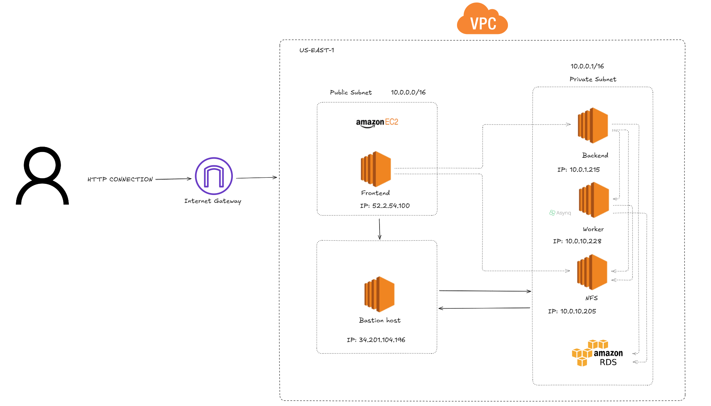

# ANB – Arquitectura de Referencia (README)

---

## 0. Propósito
Este documento describe de forma exhaustiva la arquitectura actual de ANB según el diagrama, sus componentes, relaciones, flujos de datos, requisitos de red/seguridad, observabilidad y planes de mejora. Sirve como guía operativa y como base para revisiones de diseño.

---

## 1. Visión General

**Descripción breve**:  
La aplicación ANB se despliega en una **VPC en us‑east‑1** con **subnet pública** (expuesta a Internet mediante un **Internet Gateway**) y **subnet privada** para recursos internos. Los usuarios acceden al **Frontend (EC2 público)**; este consume la **API del Backend (EC2 privado)**. Un **Worker (EC2 privado)** procesa tareas en background (Asynq). Los artefactos de video se comparten en un **servidor NFS (EC2 privado)**. La persistencia de datos se realiza en **Amazon RDS**. La administración segura de instancias privadas se hace a través de un **Bastion host (EC2 público)**.

**Elementos con sus IPs (según diagrama):**
- **Frontend (EC2, público):** `52.2.54.100`
- **Bastion host (EC2, público):** `34.201.104.196`
- **Backend (EC2, privado):** `10.0.1.215`
- **Worker – Asynq (EC2, privado):** `10.0.10.228`
- **NFS (EC2, privado):** `10.0.10.205`
- **Amazon RDS (privado):** (IP no mostrada; puerto según motor)

**Red (según rotulado del diagrama):**
- **VPC (us‑east‑1)**  
  - **Public Subnet**: `10.0.0.0/16`  
  - **Private Subnet**: `10.0.0.1/16` *(nota: este CIDR es atípico; ver recomendaciones en §10)*
- **Internet Gateway** adjunto a la VPC.

---

## 2. Contención (quién contiene a quién)

- **VPC** contiene **todas** las subnets y recursos.
  - **Public Subnet** contiene **Frontend** y **Bastion host** (ambos con IP pública y rutas a Internet via IGW).
  - **Private Subnet** contiene **Backend**, **Worker (Asynq)**, **NFS** y **RDS** (sin exposición directa a Internet).

---

## 3. Relaciones (quién se conecta a quién)

### 3.1 Flujo de usuario (norte‑sur)
1. **Cliente (Internet) → Internet Gateway → Frontend** (HTTP/HTTPS).
2. **Frontend → Backend** (llamadas a API internas sobre la red privada de la VPC).

### 3.2 Flujo de aplicación (este‑oeste)
3. **Backend ↔ NFS**: lectura/escritura de archivos (p. ej., videos subidos y procesados).
4. **Worker ↔ NFS**: consumo y producción de artefactos de procesamiento (transcoding, thumbnails, etc.).
5. **Backend ↔ Worker (Asynq)**: encolado y consumo de tareas. *Nota*: Asynq requiere **Redis**; no aparece en el diagrama. Ver §10.
6. **Backend (y/o Worker) → RDS**: operaciones de persistencia (usuarios, metadatos de videos, estados de tareas, etc.).

### 3.3 Administración
7. **Operador → Bastion (SSH)** desde Internet (IPs permitidas).  
8. **Bastion → Instancias privadas (SSH)**: Backend, Worker, NFS; acceso a **RDS** según políticas.

---

## 4. Flujos de Caso de Uso: Subida y Procesamiento de Video

1. **Subida**: el cliente envía el archivo al **Frontend** (o recibe un pre‑signed URL gestionado por Backend; patrón opcional).  
2. **Ingesta**: el **Frontend** reenvía hacia **Backend** la subida (o la firma).  
3. **Almacenamiento inicial**: el **Backend** persiste el archivo en **NFS** y registra metadatos en **RDS**.  
4. **Encolado**: el **Backend** crea una **tarea Asynq** para el **Worker** con la referencia del archivo.  
5. **Procesamiento**: el **Worker** lee del **NFS**, procesa (transcode, cortes, watermark, etc.) y escribe resultados de nuevo en **NFS**.  
6. **Actualización de estado**: el **Backend** marca la tarea como completada/failed en **RDS** y expone rutas de consulta/descarga a **Frontend**.

---

## 5. Reglas de Seguridad de Red (Security Groups – SG)

> Las reglas concretas deben adaptarse a puertos reales del Backend/API y de la base de datos.

### 5.1 Frontend (SG‑frontend)
- **Entradas**: `80/443 TCP` desde `0.0.0.0/0` (o WAF/ALB si aplica).  
- **Salidas**: acceso al **Backend** (puerto API), y DNS/NTP si procede.

### 5.2 Backend (SG‑backend)
- **Entradas**:  
  - Puerto API desde **SG‑frontend**.  
  - `22 TCP` (SSH) desde **SG‑bastion**.  
- **Salidas**:  
  - Puerto NFS `2049 TCP` hacia **SG‑nfs**.  
  - Puerto DB (p. ej., `5432` Postgres / `3306` MySQL) hacia **SG‑rds**.  
  - Puerto Redis si usa **Asynq** (ver §10).  

### 5.3 Worker (SG‑worker)
- **Entradas**: `22 TCP` desde **SG‑bastion**.  
- **Salidas**:  
  - NFS `2049 TCP` hacia **SG‑nfs`.  
  - Redis (Asynq) hacia **SG‑redis` (si aplica).  
  - DB si el Worker escribe/lee estados.

### 5.4 NFS (SG‑nfs)
- **Entradas**: `2049 TCP` desde **SG‑backend** y **SG‑worker**.  
- **Salidas**: mínimas necesarias (p. ej., updates a repos privados vía NAT si aplica).

### 5.5 RDS (SG‑rds)
- **Entradas**: puerto del motor (p. ej., `5432`/`3306`) **solo** desde **SG‑backend** (y **SG‑worker** si estrictamente requerido).  
- **Salidas**: no aplica (servicio gestionado).

### 5.6 Bastion (SG‑bastion)
- **Entradas**: `22 TCP` desde rangos de administración (IPs corporativas).  
- **Salidas**: `22 TCP` hacia **SG‑backend**, **SG‑worker**, **SG‑nfs**, y acceso a DB sólo si se requiere (mejor tunel SSH).

> **Recomendación**: Restringir por **SG → SG** (en vez de CIDR) para evitar acoplar reglas a IP privadas cambiantes.

---

## 6. Enrutamiento y Salida a Internet

- **Internet Gateway (IGW)**: adjunto a la VPC; tabla de rutas de la **public subnet** debe tener `0.0.0.0/0 → IGW`.
- **NAT Gateway (opcional/recomendado)**: si **instancias privadas** requieren salir a Internet (actualizaciones, paquetes, etc.), la **private subnet** debe enrutar `0.0.0.0/0 → NAT GW` ubicado en la **public subnet**.
- **DNS**: habilitar resolución y propagación en la VPC; usar Route 53 si se publica dominio.

## 7. Glosario de Puertos

- **HTTP/HTTPS**: `80/443 TCP`  
- **SSH**: `22 TCP`  
- **NFS**: `2049 TCP`  
- **Postgres**: `5432 TCP` / **MySQL**: `3306 TCP`  
- **Redis**: `6379 TCP`

---
