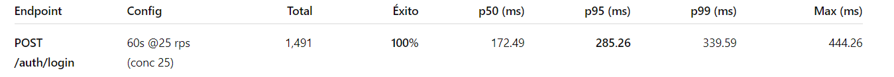

# Análisis de capacidad – ANB API (AWS, última corrida)

**Ámbito:** Backend ANB API (auth, listados públicos/privados de videos, operaciones por-id, votos).  
**Ambiente:** `http://anb-app-backend-alb-1587560747.us-east-1.elb.amazonaws.com:9090/api/v1`  
**Carpeta de salida:** `resultados-20251020-195718`

---

## 1) Resumen ejecutivo
- Se ejecutaron **2 escenarios** de lectura (moderado y estrés) más **operaciones por-id** con un video real subido desde disco.
- **Estabilidad:** 0% de errores en todos los endpoints medidos (éxito = 100%).  
- **Capacidad de lectura:**
  - **/videos (privado)** sostuvo hasta **~170 rps** con **p95 ≈ 122 ms**.
  - **/public/videos (público)** quedó por debajo del plan en estrés (**200 rps plan → 160 rps reales**) con **colas largas** (p95 ≈ 1.36 s, p99 ≈ 2.06 s).  
- **Colas / variabilidad:** ya en **75 rps** (escenario 1) el público muestra **p95 ≈ 325 ms** y **p99 > 1.3 s**: hay señales de saturación temprana en el listado público.  
- **Por-id (GET/Download/mark-processed/votes):** latencias p95 ~ 98–121 ms, comportamiento estable.

---

## 2) Escenarios y metodología
**Herramientas:**
- `loadtest.go` → genera carga contra 1 endpoint (rps, concurrencia, duración).
- `runner.go` → orquesta la **secuencia completa** (login, escenarios, upload real, pruebas por-id).

**Escenario 1 (moderado):**
- Público: **75 rps**, concurrencia **50**, **4 min**.  
- Privado: **75 rps**, concurrencia **50**, **4 min**.

**Escenario 2 (estrés):**
- Público: **200 rps**, concurrencia **100**, **5 min**.  
- Privado: **170 rps**, concurrencia **85**, **5 min**.

> Nota de upload: el endpoint devolvió **task_id** (flujo asíncrono); el `runner` resolvió el **video_id** por **título** con **polling** cada 2 s. Esto confirma que la subida se procesa en background antes de quedar visible en `/videos`.

---

## 3) Resultados (AWS)

### 3.1 Autenticación 

**Lectura:** p95 ~285 ms aceptable para auth bajo carga moderada.

---

### 3.2 Lecturas – Escenario 1 (moderado)

**Lectura:** privado estable; público ya muestra colas (p95 325 ms) y colas largas esporádicas (p99>1.3s).

---

### 3.3 Lecturas – Escenario 2 (estrés)

**Lectura:**  
- **Privado** cumple el objetivo (169.9 ~ 170 rps) con **p95 ~122 ms**.  
- **Público** no alcanza el objetivo (**160.6/200 rps**) y su **p95 ~1.36 s** indica **saturación** (colas largas/contención de recursos).

---

### 3.4 Operaciones por-id 

**Lectura:** todos por debajo de ~120 ms en p95 (descarga también estable).

---

## 4) Análisis
1. **Bottleneck en /public/videos (listado público):**  
   - A **75 rps** ya hay **p95 ≈ 325 ms** (colas incipientes).  
   - A **200 rps** el sistema se satura (solo **160 rps reales** y **p95 > 1.3 s**).  
   - Candidato a: consulta pesada (filtros/orden), falta de caché, CPU limitada por serialización, o presión en pool DB.
2. **/videos (privado) escala mejor**: mantiene el objetivo con **p95 ~122 ms** a ~170 rps → consulta más eficiente o mejor cacheabilidad.
3. **Tails (p99/max) altos** en ambos listados bajo estrés: picos de GC, thundering herd, N+1, o bursts de ALB/ENI. No afectan el éxito, sí la experiencia.
4. **Auth y endpoints por-id**: estables en p95 ~ 98–121 ms; adecuados para operaciones transaccionales.

---

## 5) Recomendaciones
**Optimización funcional (/public/videos):**
- **Agregar caché** (Redis) para el listado público (TTL 5–30 s) o **capa CDN** si la respuesta es pública/anónima.  
- **Precomputados** / materialized views si el ranking/listado deriva de cómputo costoso.  
- Revisar **índices** y **plan de consulta**; evitar ordenamientos complejos sin índice de soporte.

**Back-end / runtime:**
- Aumentar **concurrency del servidor** (worker pool, límites de conexiones) y **pool DB** con métricas de saturación.  
- **Paginación eficiente por cursor** (si aplica) para reducir payload y costo por request.  
- Habilitar **profiling** (CPU/heap) en ventana de estrés; activar **slow-logs** con umbral p95.

**Infraestructura:**
- Ajustar **Auto Scaling** (target p95 y CPU) y tamaño de instancias.  
- Revisar límites de **ALB / NLB** y **ENI** (burst de conexiones).  
- **Keep-Alive** y **compresión** activas para mejorar throughput efectivo.

**Observabilidad:**
- **Tracing distribuido** (OpenTelemetry): relación p95 ↔ spans DB/Redis/IO.  
- Dashboards por endpoint: **rps, p95, p99, 5xx, saturación de pool**. Alertas si p95>500 ms en público.

---

## 6) Conclusiones
- **Privado /videos** cumple metas de estrés (**~170 rps, p95 ~122 ms**).  
- **Público /public/videos** requiere mejoras (se queda en **~160 rps**, **p95 > 1.3 s**).  
- Con **caché + tuning DB/runtime**, es razonable aspirar a **200 rps sostenidos** en el público con **p95 < 300–400 ms**.

