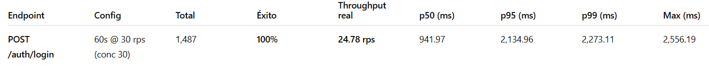
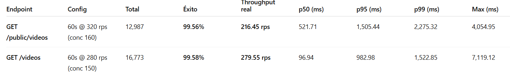

# Análisis de capacidad – ANB API (AWS)

**Ámbito:** Backend ANB API (auth, listados públicos/privados de videos, operaciones por-id, votos).  
**Ambiente:** `http://anb-backend-alb-713812655.us-east-1.elb.amazonaws.com/api/v1`  
**Carpeta de salida:** `resultados-20251127-210254`

---

## 1) Resumen de endpoints cubiertos
- **Autenticación:** `POST /auth/login` 
- **Lecturas públicas:** `GET /public/videos` 
- **Lecturas privadas (listado):** `GET /videos` 
- **Operaciones por ID:**  
  - `GET /videos/:id`  
  - `GET /videos/:id/download`  
- **Acciones:**  
  - `POST /videos/:id/mark-processed`  
  - `POST /public/videos/:id/vote`  
  - `DELETE /public/videos/:id/vote`

> Métricas clave por bloque: **Total**, **% Éxito**, **Throughput real**, **p50**, **p95**, **p99**, **Max** (ms).

---

## 2) Resultados detallados

---

### 2.1 Autenticación (cobertura ligera)

---

### 2.2 Escenario 1 – Carga sostenida moderada

---

### 2.3 Escenario 2 – Alta concurrencia (*plateau*, 7 min)

---

### 2.4 Escenario 2 – *Burst* (pico corto, 60 s)

---

### 2.5 Por-ID (ligero, estabilidad funcional)

---

## 3) Notas operativas
- Todas las ejecuciones fueron realizadas **en AWS**.  
- Los archivos CSV/JSON quedaron almacenados en la carpeta generada automáticamente por el runner (`resultados-YYYYMMDD-HHMMSS`).  
- Se verificó el correcto funcionamiento del proceso de login, subida de video y polling.

---

## 4) Evidencias (archivos generados)
- `login_load.csv/json`, `public_videos_*.csv/json`, `videos_*.csv/json`
- `video_<id>_*.csv/json`, `vote_<id>_*.csv/json`
- `headers_auth.txt`, `headers_json.txt`, `body_login.json`, `upload_resp.json`

